# Agent Strategy Design

**Creation Date**: 2024-04-29

This document outlines how the agents will interact in order to achieve the goal of assisting the user.  This design process ensures that it is clear how the Agent Graph will be constructed.  

---
## User Goals
*This process starts by outlining how the LLM will be used and what goals the user using this application is trying to achieve.*

For this project, the user is primarily me.  To start off I want to keep track of a couple of specific areas of my life to hopefully improve them through LLM augmentation.  The following outline and graph shows the 

- Task Management
  - Help the user with **daily planning & time management**
  - Identifying tasks from Todoist
  - Create new tasks in Todoist
      - First checking for existing ones
  - Identifying tasks from Calendar(?)
- Project Management
  - Help the user with **long term projects**
  - Encouraging focus on current projects
  - Maintaining project backlog
  - Creating a new project
    - Maintaining project details in database
      - Name
      - Due Date
      - Description
      - Output - Every project should have a output
    - Creating project directory in Obsidian
      - Maintain project files as embeddings
    - Maintaining a project plan
      - Collaborate with the user to create tasks
          - Include writing user story style tasks with Description & AC
          - Tasks should have a estimate
      - Maintain list of tasks with time estimates
      - Keep tasks organized by priority and dependencies
  - Archiving project that is abandoned or complete
- Infrastructure Reporting
  - Help user with **maintaining tech resources**
  - Monitoring servers for uptime
  - Reporting incidents to the user (via Pushover?)
  - Getting update information for nodes
      - Maybe leveraging Ansible & CodeLama to help the LLM maintain?

---
## Agent Process

Having _User Goals_ in mind and what sorts of activities we want the application to be able to achieve.  The next step is to work through _how_ the application/graph will work through the various tasks.

This process is a bit granular and does require us to create flow diagrams for each activity we want the application to be capable of doing.  This will help inform us on what parts of the process we need to code, and what parts can be handled by an LLM.  In addition, a challenge of using chat-based applications today is the LLM can have a hard time context shifting without explicit prompting.

### 0. Routing

As part of this application we should have a single interface for the user to interact with and schedulers to send timed requests to.  The benefit here is it simplifies how we interact with the application as opposed to having to call separate endpoints.  This means the root of our graph is a router.

The router node's goal is to generate a couple of pieces of information _before_ invoking any of the sub/nodes or "Teams".  This information may help inform the child nodes about how to complete their tasks.  Inside of the router node (or agent) we have the following chain:

The **User Input** and **Create Router State** steps are managed by the LangChain Graph as part of the setup.

**Entity Identification** can most likely be handled by the [LangChain ConversationalEntityMemory](https://python.langchain.com/docs/modules/memory/types/entity_summary_memory/) but this does require additional investigation to understand.

**Engaged agent identification** allows the router to prioritize those agents when determining which agents need to be engaged.  The line of thinking is that if the user recently interacted with a specific agent, they may want to continue doing so.

Creation of the **Execution Plan** is an LLM prompt, specifically using the [Instruct Pattern](https://medium.com/@ickman/instruct-making-llms-do-anything-you-want-ff4259d4b91). The prompt uses _chain-of-thought_ to instruct the LLM create a list of nodes which should be invoked as part of the execution and any context that they might need.

Ideally I want to follow the _Panel of Experts_ design for the result response to the user.  What this will mean is each _agent_ that is invoked will respond to the router. Their response will be collected as an AI Message with a name matching that agent.  **As part of the planning process, the router should prioritize agents who are engaged in the current conversation**.  This will require special tooling to manage the conversational memory in a way that allows for conversational memory to be both unique to an Agent as well as generalized.

The routers output is synonymous with the response the user will see.  It is what the user would think of as the AI even thought there is a team working under the hood.

### 1. Task Management

Task management will be broken down into a couple of key actions:

1. Generate a document which includes my task that are scheduled for today or are overdue (aka Daily Scrum)
2. Create new tasks in Todoist.
3. Update tasks in Todoist
4. Monitor inbox and schedule tasks as part of my routine
5. Manage the number of tasks I have at one time (recommending dates which I might have time to complete them)

#### 1.1. Daily Scrum

I currently use Todoist to manage both daily tasks, prioritization of future tasks, and as a capture system. The expectation the application on this task would be to provide me with a list of tasks I need to complete today.

**It is expected that I would converse with the application to refine my daily scrum to make adjustments to optimize the volume I am able to complete.**

Initially I expect this would be a **Scheduled Interaction**, meaning that a timer (at say 7:30 AM CST) would trigger to ask the LLM to generate todays daily schedule.

The LLM in turn would be able to pull tasks from Todoist as my task database and provide the list to me.  Possibly separated by _Label_ or _Project_ based on how they are stored in Todoist.

```mermaid
graph LR;
  trigger(["🕑 Trigger @ 07:30"])
  fetch[["Get list of\ntasks label 'Today'"]]
  format[["Describe each task using\nthe various attributes"]]
  generateScrum[[Generate Scrum Messaging]]
  generate[["Generate daily scrum chat"]]
  return([Initiate Conversation])

  trigger-->fetch
  fetch-->format
  format-->generateScrum
  generateScrum-->generate
  generate-->return
```

This data will be provided as the start of a "_Daily Scrum_" conversation.  The user can speak to whether they think a task will get done today or not and the Application can update the Tasks Accordingly. 

We should be able to use the [Todoist API](https://developer.todoist.com/rest/v2/?python#get-active-tasks)'s _getActiveTasks_ method at least to start.

> **Importantly, if the user does not respond to the assistant we should make note of that**.  My belief is that allowing the LLM to react to the users absence as a way to make the LLM feel more alive.
> 
> I anticipate that as part of generating the daily scrum conversation message, the LLM would note if the user missed days recently.  There may be a window in the future for the application to respond empathetically if the user provides an explanation.

#### 1.2. Task Creation

One of the most important actions that the Task Management Agent can take is the creation of new tasks. This has significant automation potential, allowing me to create tasks not only through conversation but also from other agents as well.  For example, the Project Agent may ask to create the next task for our project or the Infrastructure Agent may ask to create a task to check on a specific device.

For this action, the agent will need to have an understanding of what values are needed to create a task using the [Todoist API](https://developer.todoist.com/rest/v2/?python#tasks).

Since the agent already expects the inputs to be correct, it is mostly just calling the Todoist API.

```mermaid
flowchart LR
  input(["✉ Incoming Message"])
  format[[Format API Call]]
  review[Review API Response]
  output([Chat Response])

  input-->format-->review-->output
```

The response here should describe what was created by the Agent.  This is important for the user contextually to know as part of the larger conversation and can help the application avoid making duplicate records.

### 2. Project Management

### 3. Infrastructure Management

---
## Tool Design

Based on the _User Goals_ and the _Agent Processes_, we get a picture of what tools we need to develop to assist the application.  Sometimes referred to as _environments_ that the application can interact with, these _tools_ allow the application to make change in the world.

A tool at it's core has the following shape:

Based on the [Agent Process](#agent-process) section, we can identify the following tools:

| Tool Name | Description | Used By |
| :-: | --- | --- |
| Get Agent Memory | Fetches the memory nodes from the DB related specifically to an agent | Router
| Todoist Get Tasks | Fetches task from the Todoist API if an API key is provided in the application configuration | Task Management: Daily Scrum |
| Todoist Create Task | Create a new task in Todoist |  |
| Todoist Update Task | Create a new task in Todoist |  |